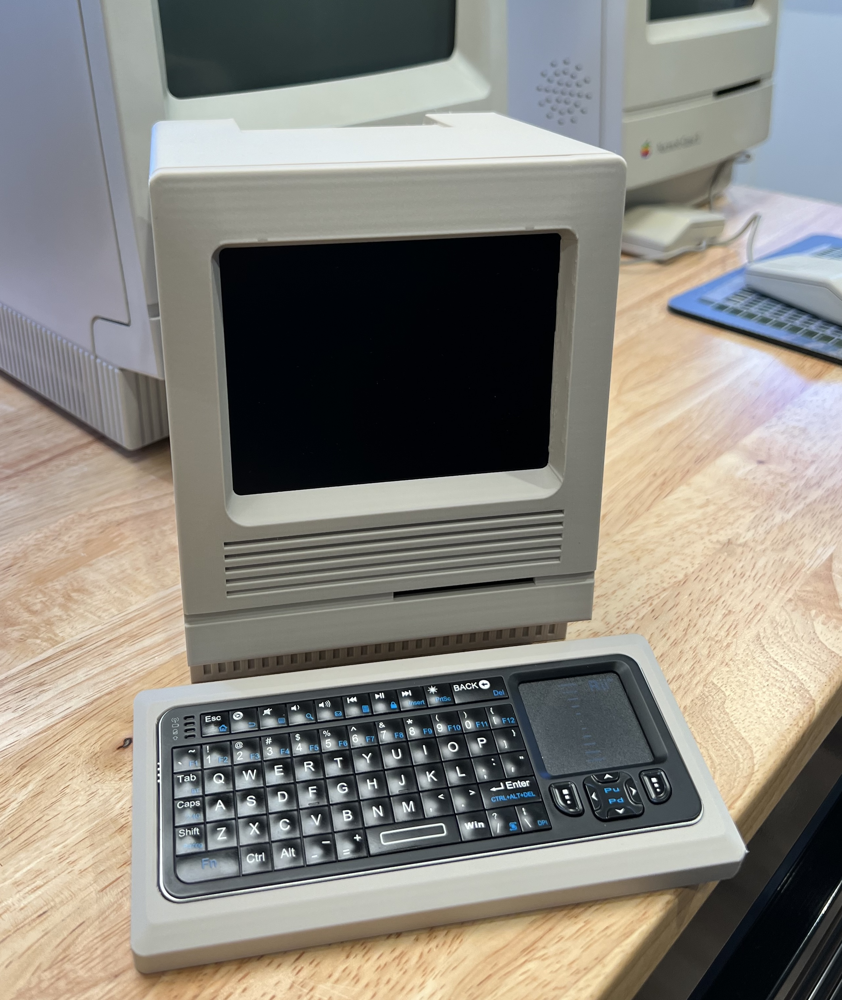
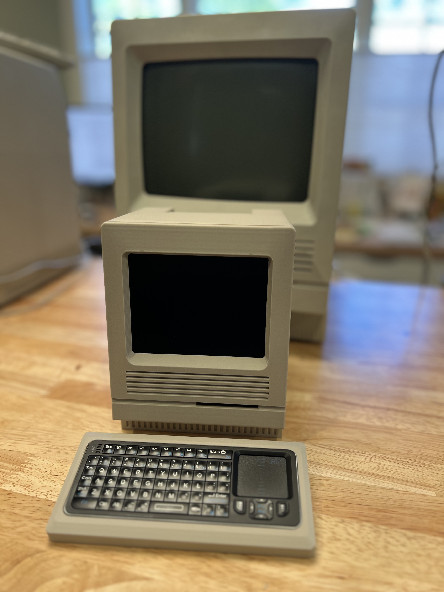
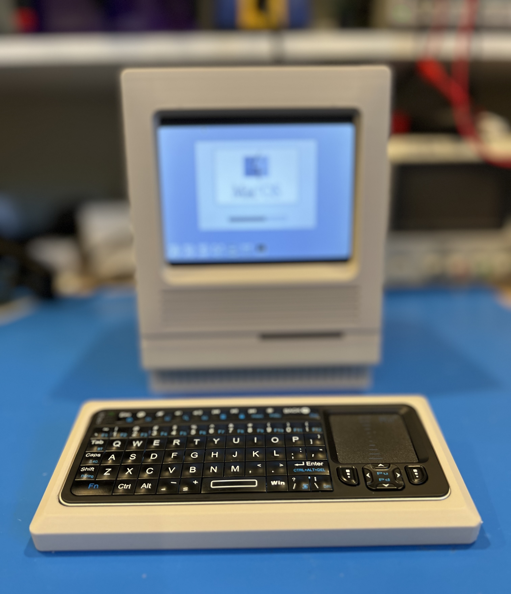
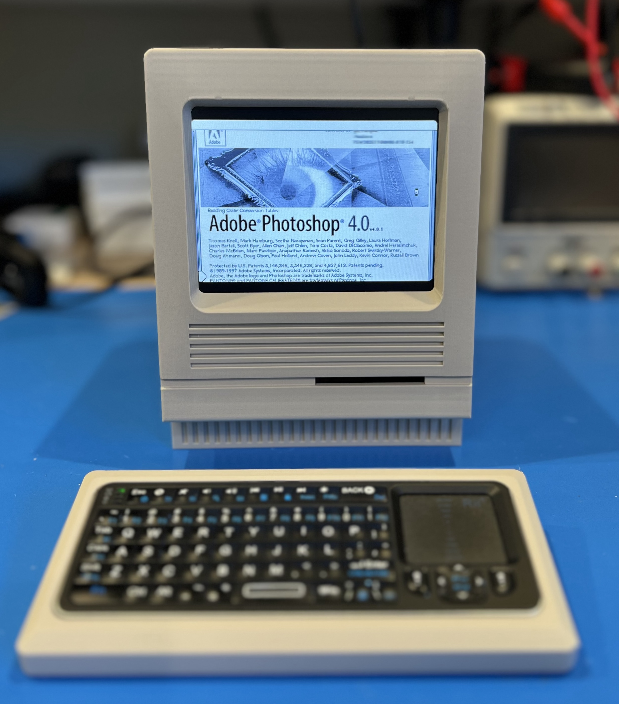

# FauxMac

This repository contains the instructions for building a Faux [Compact Mac](https://en.wikipedia.org/wiki/Compact_Macintosh). The model is meant to evoke the feel of an early Macintosh, but is not an exact replica of any specific model. For example, the case is more like an SE or SE/30, but the keyboard is more like an M0110, which goes along with a Mac 128K. The case has mounting spots for a Raspberry Pi, display, and associated hardware that allow you to run a Macintosh emulator to get the 1980's Mac experience.

There are two Mac emulators that I have tried and they are [packaged together on GitHub](https://github.com/kanjitalk755/macemu/tree/master): Basilisk II and SheepShaver. The latter will emulate PowerPC versions of the Mac. I tend to use the former (Basilisk II), and the instructions will refer to it.

Take a look at a [short video](https://youtu.be/NNNNNN) of the model in operation.

**[INSTRUCTIONS](Instructions.md)**: This document desribes how to print, assemble, wire, and prepare software for FauxMac.

***THIS IS A WORK IN PROGRESS***: The documentation on required electronics, wiring, and software setup is not complete. At this point you should consider yourself an alpha-tester! Please let me know of an errors or ommissions.

The STL files for FauxMac can be found on [printables](https://www.printables.com/model/946687).

***This model may not be used for commercial purposes as noted in the license***.

## Potential Future Work

* **Audio**: Add an internal audio amp and speaker. At the moment you should be able to use a bluetooth speaker or headphones, but this is untested.
* **External HDMI Connector**: It might be nice to be able to display on a larger screen when demonstrating the mac emulator to a group of people. When using a Pi 4 or 5, the secondary HDMI port could go to an HDMI connector on the back panel.
* **Face Decal**: A 3D-printed Mac logo and text for the front of the case would be too small for good detail and requires multiple colors. Instead I will provide an SVG that can be used to create a decal on a cutting machine like a Cricut. I am making an SE/30 decal even though FauxMac is not a recreation of any particular Mac. Here's an example of an SE/30 decal I'm making.

  
